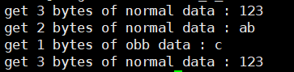
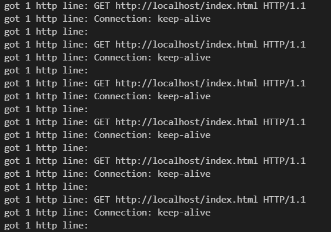

# Linux 高性能服务器编程 examples

## :raising_hand_man: 说明

主要针对 **《Linux 高性能服务器编程》** 中一些重要的例子进行实践。

 :blue_book:  实践内容如下：

:orange: **<font color = 008F88>IO 复用</font>** ：

　　:one: **select** ：处理带外数据 （P148）

​		:two: **poll** ：聊天室程序 （P165）

​		:three: **epoll** ：同时处理 TCP 和 UDP 服务 （P171）

​		:four:  **LT 和 ET 模式** ：LT 和 ET 模式（P154）

​		:five: **epoll + ET + EPOLLONESHOT** ：使用 EPOLLONESHOT 事件 （P157）

:lemon: **<font color = 008F88>有限状态机</font>** ：HTTP 请求读取和分析 （P137）

:apple: **<font color = 008F88>统一事件源</font>** ： 统一事件源 （P184）

:pineapple: **<font color = 008F88>定时器</font>** ：

​		:one: 基于升序链表的定时器 （P196）

​		:two: 处理非活动连接 （P200）

:peach: **<font color = 008F88>共享内存</font>** ：聊天室服务器程序（ **进阶** ：使用共享内存）（P255）

:watermelon: **<font color = 008F88>进程池与线程池</font>** ：

​		:one: 半同步/半异步进程池 （P289）

​		:two: 用进程池实现简单的 CGI 服务器 （P298）

​		:three: 半同步/半反应堆线程池 （P301）

:grapes: **<font color = 008F88>web 服务器</font>** ：

​		:one: http_conn 类  （P304）

​		:two: main 函数 （P318）

​		:three: 压力测试 （P329）

> 参考：《Linux 高性能服务器编程》
>
> 笔记：
>
> 代码见仓库:house_with_garden: : [Linux_Server_Programming_emamples](https://github.com/czGitAccount/Linux_Server_Programming_emamples)

----

## 1 IO 复用

### 1.1 同时接收普通数据和带外数据

服务器代码使用 **select** 监听可读事件，以及异常事件，接收到客户端发送的数据后输出。

:small_blue_diamond: 服务器接收数据：

```c++
// 监听读事件 异常事件
ret = select(connfd + 1, &read_fds, NULL, &exception_fds, NULL);

// ...
    
if (FD_ISSET(connfd, &read_fds)) {
	ret = recv(connfd, buf, sizeof(buf) - 1, 0);
    // 输出语句 ...
} 
// 对于异常事件，采用带 MSG_OOB 标志的 recv 函数读取数据
else if (FD_ISSET(connfd, &exception_fds)) {
	ret = recv(connfd, buf, sizeof(buf) - 1, MSG_OOB);
	// 输出语句 ...
}
```

:small_orange_diamond: 客户端发送数据：

```c++
const char* oob_data = "abc";
const char* normal_data = "123";

send(sockfd, normal_data, strlen(normal_data), 0);
send(sockfd, oob_data, strlen(oob_data), MSG_OOB);
send(sockfd, normal_data, strlen(normal_data), 0);
```

:star: 运行结果：



**<font color = FF8888>发现</font>** ​ :eyes: ：客户端发送给服务器的 3 字节的带外数据 “abc” 中仅有最后一个字符 “c” 被服务器当成了真正的带外数据接收。

**<font color = FF8888>补充</font>** :raising_hand: 

在 Linux 环境下，内核通知应用程序带外数据到达主要有两种方法：

:small_blue_diamond: IO 复用技术，**select** 等系统调用在接收到带外数据时返回，并向应用程序报告 socket 上的异常事件，如1.1的例子。

:small_orange_diamond: 使用 SIGURG 信号，见代码清单 10-3 ： 用 **SIGURG** 检测带外数据是否到达。

服务器代码：`1_1_server.cpp`  客户端代码：`1_1_client.cpp`

> 详细代码见仓库 :house_with_garden: : [Linux_Server_Programming_emamples](https://github.com/czGitAccount/Linux_Server_Programming_emamples)

----

### 1.2 聊天室程序

该聊天室能够让所有用户同时在线群聊，它分为客户端和服务器两个部分，利用 **poll** 实现。

**<font color = 008F88>客户端</font>** 程序有 **两个** 功能：

:small_blue_diamond: 一是从标准输入终端读入用户数据，并将用户数据发送至服务器；

```c++
// 利用 splice 函数将用户输入内容直接定向到网络连接上以发送之
// 从而实现数据零拷贝，提高了程序执行效率   fds[0].fd = 0 标准输入
else if (fds[0].revents & POLLIN) {
	ret = splice(0, NULL, pipefd[1], NULL, 32768, SPLICE_F_MORE | SPLICE_F_MOVE);  // 标准输入 --> 管道写端
	ret = splice(pipefd[0], NULL, sockfd, NULL, 32768, SPLICE_F_MORE | SPLICE_F_MOVE);  // 管道读端 --> socket
}
```

:small_orange_diamond: 二是往标准输出终端打印服务器发送给它的数据。

```c++
else if (fds[1].revents & POLLIN) {
    memset(read_buf, '\0', BUFFER_SIZE);
    recv(fds[1].fd, read_buf, BUFFER_SIZE - 1, 0);  // 接收服务器数据
    std::cout << read_buf << std::endl; // 打印
}
```

**<font color = 008F88>服务器</font>** 的功能时接收客户数据，并把客户数据发送给每一个登录到该服务器上的客户（发送数据者除外）。

:small_blue_diamond: 客户数据结构体，以及非阻塞设计：

```c++
// 客户数据：
struct client_data {
    sockaddr_in address;     // 客户端 socket 地址
    char *write_buf;		 // 待写到客户端的数据的位置
    char buf[BUFFER_SIZE];	 // 从客户端读入的数据
};

int setnonblocking(int fd) {
    int old_option = fcntl(fd, F_GETFL);        // 记录之前 fd 的 flag
    int new_option = old_option | O_NONBLOCK;	// 添加非阻塞 flag
    fcntl(fd, F_SETFL, new_option);			    // 设置非阻塞
    return old_option;							// 返回文件描述符旧的状态
}												// 以便日后恢复该状态标志
```

:small_orange_diamond: 创建用户数组，poll 检测用户状态

```c++
// 创建 users 数组，分配 FD_LIMIT 个 client_data 对象
// 每个可能的 socket 连接都可以获得一个这样的对象
// 并且 socket 的值可以直接用来索引 socket 连接对应的 client_data 对象
client_data *users = new client_data[FD_LIMIT];

// 尽管分配了足够多的 client_data 对象，但为了提高poll的性能，仍然有必要限制用户数量
pollfd fds[USER_LIMIT + 1];

// 其中 fds[0] 用来处理连接请求
fds[0].fd = listenfd;
fds[0].events = POLLIN | POLLERR;
fds[0].revents = 0;
```

:small_blue_diamond: 处理各种情况：

连接请求、错误信息、客户端关闭连接、处理用户输入数据和发送用户数据。

``` c++
// 处理连接请求, 内部需要考虑用户数量
if (fds[i].fd == listenfd && (fds[i].revents & POLLIN)) {...}
// 处理错误信息，利用 getsocketopt 获取错误信息
else if (fds[i].revents & POLLERR) {...}
// 处理客户端关闭连接
else if (fds[i].revents & POLLRDHUP) {...}
// 处理用户输入数据: 接收用户数据，并写入到服务器连接的所有其他socket写缓存
else if (fds[i].revents & POLLIN) {...}
// 发送数据给客户: 发送 socket 写缓存中的数据
else if (fds[i].revents & POLLOUT) {...}
```

:star: 运行结果：

连接 5 个用户，超出连接数量，会导致服务器拒绝服务。


用户（ `fd = 4、5、8` ）分别发送消息


除了发送者，所有用户都会接收到信息，用户（ `fd = 6` ）终端结果如下：


服务器代码： `1_2_chat_server.cpp`  客户端代码：  `1_2_chat_client.cpp`

> 详细代码见仓库 :house_with_garden: : [Linux_Server_Programming_emamples](https://github.com/czGitAccount/Linux_Server_Programming_emamples)

----

### 1.3 同时处理 TCP 和 UDP 服务

从 **bind** 系统调用的参数来看，一个 socket 只能与一个 socket 地址绑定，即一个 socket 只能用来监听一个端口。因此，服务器如果要同时监听多个端口，就必须创建多个 socket，并将它们分别绑定到各个端口上。这样一来，服务器程序就需要同时管理多个监听 socket，IO 复用技术就有了用武之地。另外，即使是同一个端口，如果服务器同时处理该端口上 TCP 和 UDP 请求，则也需要创建不同的 socket：一个流 socket，另一个是数据报 socket，并将它们都绑定到该端口上。

**<font color = 008F88>服务器</font>** 处理 TCP连接请求，接收 TCP 数据、接收 UDP 数据，并对它们做回声处理（回射服务器）；

:small_blue_diamond: 处理 TCP UDP 请求

```c++
// 注册事件
epoll_event events[MAX_EVENT_NUMBER];
int epollfd = epoll_create(5);
addfd(epollfd, listenfd);
addfd(epollfd, udpfd);
// 辅助函数
void addfd(int epollfd, int fd) {
    epoll_event event;
    event.data.fd = fd;
    event.events = EPOLLIN | EPOLLET;  // 读事件 | ET触发
    epoll_ctl(epollfd, EPOLL_CTL_ADD, fd, &event);
    setnonblocking(fd);  // 设置非阻塞
}

// 使用 epoll 来监听 TCP / UDP
while (1) {
    int number = epoll_wait(epollfd, events, MAX_EVENT_NUMBER, -1);
	for (int i = 0; i < number; i++) {
    	if (sockfd == listenfd) {...}        			// 处理 TCP 连接   
		else if (sockfd == udpfd) {...}					// 接收 UDP 数据
		else if (events[i].events & EPOLLIN) {...};		// 接收 TCP 数据	   
    }	
}   	
```

**<font color = FF8888>注意</font>** :raising_hand: ：此时 UDP 与 TCP 连接可以绑定相同的 address ，同一个端口的 TCP UDP 服务。

```c++
// 此时 address 设置已经完成 省略...
int udpfd = socket(PF_INET, SOCK_DGRAM, 0);
assert(udpfd >= 0 );
ret = bind(udpfd, (struct sockaddr*)&address, sizeof(address));
assert(ret != -1);
```

:star: 运行结果：

两个客户端的发送数据都是 `  const char *sendbuf = "hello!\n";`

TCP 回声结果：


udp 回声结果：


服务器代码： `1_3_server.cpp`  客户端代码： `1_3_client_udp.cpp` 、 `1_3_client_udp.cpp`

> 详细代码见仓库 :house_with_garden: : [Linux_Server_Programming_emamples](https://github.com/czGitAccount/Linux_Server_Programming_emamples)

----

### 1.4 LT 和 ET 模式

epoll 对文件描述符的操作有两种模式：LT 模式和 ET 模式。LT 模式是默认的工作模式，这种模式下 epoll 相当于一个效率较高的 epoll。当往 epoll 内核事件表中注册一个文件描述符上的 **EPOLLET** 事件时，epoll 将以 ET 模式来操作该文件描述符。ET 模式是 epoll 的高效工作模式。

对于采用 LT 工作模式的文件描述符，当 **epoll_wait** 检测到其上有事件发生并将此事件通知应用程序后，应用程序可以不立即处理该事件。这样，当应用程序下一次调用 **epoll_wait** 时，**epoll_wait** 还会再次向应用程序通知此事件，知道该事件被处理。而对于采用 ET 工作模式的文件描述符，当 **epoll_wait** 检测到其上有事件发生并将此事件通知应用程序后，应用程序必须立即处理该事件，因此后续的 **epoll_wait** 调用将不再向应用程序通知这一事件。可见，ET 模式在很大程度上降低了同一个 epoll 事件被重复触发的次数，因此效率要比 LT 模式高。

但是也正是因为内核只会向应用程序通知一次，所以对于连续的数据多次发送的情况下，需要通过其他的机制通知应用程序。

```c++
// 会通过 errno == EAGAIN 或者 EWOULDBLOCK 来判断接受是否完成
if ((errno == EAGAIN) || (errno == EWOULDBLOCK)) {
    std::cout << "read later" << std::endl;
    break;
}
```

:star: 运行结果：（发送长度超过 **BUFFFER_SIZE** 长度的消息，见下）


:small_blue_diamond: LT 模式：


可以发现随着每次的 **epoll_wait** 的调用，都会触发打印 *event trigger once* 语句。

:small_orange_diamond: ET 模式：


可以发现后面的 **epoll_wait** 的调用，并不会触发打印 *event trigger once* 语句，最后会出现 `errno == EAGAIN` 打印 **read later** 语句


服务器代码： `1_4_server.cpp`  客户端代码： `1_2_chat_client.cpp` 

> 详细代码见仓库 :house_with_garden: : [Linux_Server_Programming_emamples](https://github.com/czGitAccount/Linux_Server_Programming_emamples)

----

### 1.5 使用 EPOLLONESHOT 事件

即使使用 ET 模式，一个 **socket** 上的某个事件还是可能被触发多次。比如一个线程在读取完某个 socket 上的数据后开始处理这些数据，而在数据的处理过程中该 socket 上又有新数据可读（**EPOLLIN** 再次被触发），此时另一个线程被唤醒来读取这些新的数据。于是就出现了两个线程同时操作一个 socket 的局面。这当然不是被期望的，我们期待的是一个 socket 连接在任一时刻都只被一个线程处理。可以用 **epoll** 的 **EPOLLONESHOT** 事件实现。

对于注册了 **EPOLLONESHOT** 事件的文件描述符，操作系统最多触发其上注册的一个可读、可写或者异常事件，且只触发一次，除非我们使用 **epoll_ctl** 函数重置该文件描述符上注册的 **EPOLLONESHOT** 事件。这样，当一个线程在处理某个 socket 时，其他线程是不可能有机会操作该 socket 的。

但是需要注意 :raising_hand_man: ：注册了 **EPOLLONESHOT** 事件的 socket 一旦被某个线程处理完毕，该线程就应该立即重置这个 socket 上的 **EPOLLONESHOT** 事件，以确保这个 socket 下一次可读时，其 **EPOLLIN** 事件能被触发，进而让其他工作线程有机会继续处理这个 socket。

**<font color = 008F88>服务器</font>** 工作线程函数处理完某个 socket 上的一次请求之后，又接收到该 socket 上新的客户请求，则该线程将继续为这个 socket 服务。并且因为该 socket 上注册了 **EPOLLONESHOT** 事件，其他线程没有机会接触这个 socket，如果工作线程等待 5s 后仍然没有收到该 socket 上的下一批客户数据，则它将放弃为该 socket 服务，同时调用 `reset_oneshot` 函数来重置该 socket 上的注册事件，这将使 epoll 有机会再次检测到该 socket 上的 **EPOLLIN** 事件，进而使得其他线程有机会为该 socket 服务。

:star: 运行结果：


服务器代码： `1_5_server.cpp`  客户端代码： `1_5_client.cpp` 

> 详细代码见仓库 :house_with_garden: : [Linux_Server_Programming_emamples](https://github.com/czGitAccount/Linux_Server_Programming_emamples)

----

## **2 有限状态机** 

本节是一个有限状态机应用的一个实例：HTTP 请求的读取和分析。很多网络协议，包括 TCP 协议和 IP 协议，都在其头部中提供头部长度字段。程序根据该字段的值就可以知道是否接收到一个完整的协议头部。但 HTTP 协议并未提供这样的头部长度字段，并且其头部长度变化也很大，可以只有十几字节，也可以有上百字节。根据协议规定，判断 HTTP 头部结束的依据是遇到一个空行，该空行仅包含一对回车换行符（`<CR><LF>`，或者 `\r\n`）。如果一次读操作没有读入 HTTP 请求的整个头部，即没有遇到空行，那么就必须等待客户继续写数据并再次读入。因此，每完成一次读操作，就要分析新读入的数据中是否有空行。不过在寻找空行的过程中，程序可以同时完成对整个 HTTP 请求头部的分析，以提高解析 HTTP 请求的效率。

以下代码使用主、从两个有限状态机实现了最简单的 HTTP 请求的读取和分析，为了表述简洁，直接称 HTTP 请求的一行（包括请求行和头部字段）为行。

:small_blue_diamond: 从状态机，用于解析出一行内容，从状态机的转换图如下所示：


:small_orange_diamond: HTTP 请求的入口函数（主状态机）

主状态机使用 **checkstate** 变量来记录当前状态。如果当前的状态是 **CHECK_STATE_REQUESTLINE**，则表示 `parse_line` 函数解析出的行是请求行，于是主机状态机调用 `parse_requestline` 来分析请求行；如果当前的状态时 **CHECK_STATE_HEADER**，则表示 `parse_line` 函数解析出的是头部字段，于是主机状态调用 `parse_headers` 来分析头部字段。**checkstate** 变量的初始值是 **CHECK_STATE_REQUESTLINE**，`parse_requestline` 函数在成功地分析完请求行之后将其设置为 **CHECK_STATE_HEADER**，从而实现状态转移。

:small_blue_diamond:  分析请求行

请求行主要分析：请求方法，URL，协议版本。

```c++
// 请求方法分析
if (strcasecmp(method, "GET") == 0) {
    printf("The request method is GET\n");
} else {
    return BAD_REQUEST;
}

// ...

// 协议版本分析
if (strcasecmp(version, "HTTP/1.1") != 0) {
    return BAD_REQUEST;
}

// URL 分析

if (strncasecmp(url, "http://", 7) == 0) {
    url += 7;
    url = strchr(url, '/');
}
if (!url || url[0] != '/') {
    return BAD_REQUEST;
}
printf("The request URL is : %s\n", url);

// 可以发现成功分析完请求行后会将主状态机 checkstate 设置为 CHECK_STATE_HEADER
checkstate = CHECK_STATE_HEADER;
```

:small_orange_diamond: 分析头部字段

```c++
// 遇到一个空行，说明得到一个正确地 HTTP 请求
if (temp[0] == '\0') {
    return GET_REQUEST;
} 
// 处理 “HOST” 头部字段
else if (strncasecmp(temp, "Host:", 5) == 0) {
    temp += 5;
    temp += strspn(temp, " \t");
    printf("the request host is: %s\n", temp);
} 
// 其他头部字段都不处理
else {
    printf("I can not handle this header\n");
}
```

:star: 运行结果：

:small_blue_diamond: 客户端发送请求一：（支持 GET 操作）

```c++
const char *buf = "GET /http://example/hello.html HTTP/1.1\r\n\r\nHost:hostlocal";
send(sock, buf, strlen(buf), 0);
```


:small_orange_diamond: 客户端发送请求二： （不支持 POST 操作）

```c++
const char *buf = "POST /http://example/hello.html HTTP/1.1\r\n\r\nHost:hostlocal";
send(sock, buf, strlen(buf), 0);
```


服务器代码： `GET_HOST_test.cpp`  ，客户端代码：`2_1_client.cpp`

> 详细代码见仓库 :house_with_garden: : [Linux_Server_Programming_emamples](https://github.com/czGitAccount/Linux_Server_Programming_emamples)

----

## **3 统一事件源**

信号是一种 **异步** 事件：信号处理函数和程序的主循环是两条不同的执行路线。很显然，信号处理函数需要尽可能快地执行完毕，以确保该信号不被屏蔽太久。一种典型地解决方案是：把信号的主要处理逻辑放到程序地主循环，主循环再根据接收到的信号值执行目标信号对应的逻辑代码。信号处理函数通常使用 **管道** 来将信号“传递”给主循环：怎么知道管道上何时有数据可读？这很简单，只需要使用 IO 复用系统调用来监听管道的读端文件描述符上的可读事件。如此一来，信号事件就能和其他 IO 事件一样被处理，即统一事件源。

```c++
// ~ 监听管道读端 读事件
else if ((sockfd == pipefd[0]) && (events[i].events & EPOLLIN)) {
    int sig;
    char signals[1024];
    ret = recv(pipefd[0], signals, sizeof(signals), 0);
    if (ret == -1) continue;
    else if (ret == 0) continue;
    else {  // ~ 因为每个信号值占一个字符，所以按照字节逐个接收信号
        for (int i = 0; i < ret; ++i) {
            switch (signals[i]) {
                case SIGCHLD:
                case SIGHUP: {
                    continue;
                }
                case SIGTERM: 
                case SIGINT: { 
                    stop_server = true; 
                    std::cout << "CTRL + C --> close fds" << std::endl;
                }
            }
        }
    }
```

:star: 运行结果：

服务器运行后，键入 CTRL + C 接收到中断信号。


服务器代码： `1_3_server.cpp`  

> 详细代码见仓库 :house_with_garden: : [Linux_Server_Programming_emamples](https://github.com/czGitAccount/Linux_Server_Programming_emamples)

----

## **4 定时器** 

本节通过一个实例——处理非活动连接，来介绍如何使用 **SIGALRM** 信号定时。不过，需要先给出一种简单的定时器实现——基于升序链表的定时器，并把它应用到处理非活动连接这个实例中。

### 4.1 基于升序链表的定时器

定时器通常至少包含两个成员：一个超时时间和一个任务回调函数。有时候还可能包含回调函数被执行时需要传入的参数，以及是否重启定时器等信息。如果使用链表作为容器来串联所有的定时器，则每个定时器还要包含指向下一个定时器的指针成员。进一步，如果链表是双向的，则每个定时器还需要包含指向前一个定时器的指针成员。

:small_blue_diamond: 所需数据结构：

```c++
// 用户数据结构: 客户端 socket 地址、socket 文件描述符、读缓存和定时器
struct client_data {...}; 
// 定时器类: 任务超时事件, 任务回调函数, 用户数据结构, 指向前一个定时器, 指向后一个定时器
class util_timer {...};
// 定时器链表，它是一个升序、双向链表，且带有头结点和尾结点
class sort_timer_lst {...};
// 内部包含：构造函数，析构函数
// add_timer (将 timer 添加到链表)
// adjust_timer (调整对应的定时器在链表中的位置)
// del_timer (将 timer 从链表中删除)
// tick (心搏函数，已处理链表上到期的任务)
```

:small_orange_diamond: 定时器链表成员函数：

```c++
// 有序链表的插入、删除和调整操作都需要判断头尾节点。
// 有序链表插入操作，通过 timer->expire 来进行判断
void add_timer(util_timer *timer) {...}

// 有序链表调整操作，通过 timer->expire 来进行判断
void adjust_timer(util_timer *timer) {...}

// 有序链表删除操作，通过 timer->expire 来进行判断
void del_timer(util_timer *timer) {...}

// SIGALRM 信号每次被触发就在其信号处理函数(如果使用统一事件源，则是主函数)
// 中执行一次 tick 函数以处理链表上到期的任务
// 内部会使用回调函数, 以执行定时任务，执行完定时器中定时任务之后
// 就将它从链表中删除,并重置链表头结点
void tick() {...}
```

将所有实现包含在头文件中，其核心函数 **tick** 相当于一个心搏函数，它每隔一段固定的时间就执行一次，以检测并处理到期的任务。判断定时任务到期的依据是定时器的 **expire** 值小于当前的系统时间。从执行效率来看，添加定时器的时间复杂度是 $O(n)$ ，删除定时器的时间复杂度是 $O(1)$ ，执行定时任务的时间复杂度是 $O(1)$ 。

头文件： `lst_timer.h`  

> 详细代码见仓库 :house_with_garden: : [Linux_Server_Programming_emamples](https://github.com/czGitAccount/Linux_Server_Programming_emamples)

----

### 4.2 处理非活动连接

服务器利用 **alarm** 函数周期性地触发 **SIGALRM** 信号，该信号的信号处理函数利用管道通知主循环执行定时器链表上的定时任务——关闭非活动的连接。（利用管道通知主循环信号的方法，见统一事件源）；

服务器代码处理大于 `3 * TIMESLOT` 时间非活动的客户端。每个客户端都有一个定时器，定时器记录了最后一次客户端的活动时间，每次客户连接上有数据可读，则需要调整该连接对应的定时器，以延迟该连接被关闭的时间，但同时也可能是删除操作。

:small_blue_diamond: 服务器设置客户端定时器

```c++
// 客户端设置定时器
 if (sockfd == listenfd) {
     struct sockaddr_in client_address;
     socklen_t client_addrlength = sizeof(client_address);
     int connfd = accept(listenfd, (struct sockaddr*)&client_address, &client_addrlength);
     addfd(epollfd, connfd);
     users[connfd].address = client_address;
     users[connfd].sockfd = connfd;
     util_timer *timer = new util_timer;
     timer->user_data = &users[connfd];
     timer->cb_func = cb_func;  // 设置回调函数
     time_t cur = time(NULL);
     timer->expire = cur + 3 * TIMESLOT;  // 定时器设置
     users[connfd].timer = timer;
     timer_lst.add_timer(timer);
 }
```

:small_orange_diamond: 有数据可读，调整定时器

```c++
// 有数据可读，调整定时器
else if (events[i].events & EPOLLIN) {
    memset(users[sockfd].buf, '\0', BUFFER_SIZE);
    ret = recv(sockfd, users[sockfd].buf, BUFFER_SIZE - 1, 0);
    std::cout << "get " << ret << " bytes of client data " << users[sockfd].buf << " from " << sockfd << std::endl;
    util_timer *timer = users[sockfd].timer;
    if (ret < 0) {
        if (errno != EAGAIN) {
            cb_func(&users[sockfd]);
            if (timer) timer_lst.del_timer(timer);  // 删除定时器操作
        }
    } else if (ret == 0) {
        cb_func(&users[sockfd]);
        if (timer) timer_lst.del_timer(timer);      // 删除定时器操作
    } else {
        if (timer) {  // 调整定时器操作
            time_t cur = time(NULL);
            timer->expire = cur + 3 * TIMESLOT;
            std::cout << "adjust timer once " << std::endl;
            timer_lst.add_timer(timer);
        }
    }
} 
```

:star: 运行结果：（ 关闭时间： `3 * TIMESLOT` ）

测试条件一：

```c++
const char *sendbuf = "hello\n";
while (1) {        
    send(sock, sendbuf, sizeof(sendbuf), 0);
    sleep(10);   // 设置 10 秒 活动一次
}
```

测试条件二：

```c++
const char *sendbuf = "hello\n";
while (1) {        
    send(sock, sendbuf, sizeof(sendbuf), 0);
    sleep(20);   // 设置 20 秒 活动一次
}
```

所以测试条件一，该客户端可以一直保持连接。


所以测试条件二，由于客户端超过 15 s 没有活动，所以被客户端强制关闭连接。


头文件： `lst_timer.h`  ，服务器代码：`4_2_server.cpp` ，客户端代码：  `4_2_client.cpp` 

> 详细代码见仓库 :house_with_garden: : [Linux_Server_Programming_emamples](https://github.com/czGitAccount/Linux_Server_Programming_emamples)

----

## 5 共享内存

将之前的聊天室服务器程序，修改为一个多进程服务器：一个子进程处理一个客户连接。同时，我们将所有客户 socket 连接的都缓冲设计为一块共享内存。

整个 **<font color = 008F88>通信建立流程</font>** 分为了三个部分：

:small_blue_diamond: 客户端发起连接请求，服务器处理连接请求，并完成连接建立

```c++
if (sockfd == listenfd) {  // ~ 监听连接时间
    struct sockaddr_in client_address;
    socklen_t client_addrlength = sizeof(client_address);
    int connfd = accept(listenfd, (struct sockaddr*)&client_address, &client_addrlength);
//    ...
```

:small_orange_diamond: 服务器为该连接创建子进程（继承 **connfd** ），并关闭父进程 **connfd** ，将与客户通信操作交给子进程。

```c++
pid_t pid = fork();
if (pid < 0) { // 创建失败
    close(connfd);
    continue;
}
else if (pid == 0) { // ~ 子进程
    // ...
    // 处理函数
    run_child(user_count, users, share_mem);
	// ...
}
else { // ~ 父进程
     close(connfd); // 关闭
     // ...
 }
```

:small_blue_diamond: 父子进程间通过管道连接，子进程通知父进程有数据传来需要被处理，父进程通知子进程发送处理后的数据。主要通过子进程来作为中转站，子进程需要同时监听客户端 socket，以及与父进程之间的管道。

```c++
// ==== 主循环中 ====
// 某个子进程通知父进程处理数据 (父进程接收到子进程的通知)
else if (events[i].events & EPOLLIN) {
    int child = 0; 
    ret = recv(sockfd, (char*)&child, sizeof(child), 0);
    std::cout << "read data from child accross pipe" << std::endl;
    if (ret == -1) continue;
    else if (ret == 0) continue;
    else {
        // ~ 向除负责处理第 child 个客户连接的子进程之外的其他子进程发送消息
        for (int j = 0; j < user_count; ++j) {
            if (users[j].pipefd[0] != sockfd) {
                std::cout << "send data to child accross pipe : " << child << std::endl;
                // 通知子进程
                send(users[j].pipefd[0], (char*)&child, sizeof(child), 0);
            }
        }
    }
}
// ==== run_child 循环中 ====
// 子进程负责的客户连接有数据到达
if ((sockfd == connfd) && (events[i].events & EPOLLIN)) {
    memset(share_mem + idx * BUFFER_SIZE, '\0', BUFFER_SIZE);
    ret = recv(connfd, share_mem + idx * BUFFER_SIZE, BUFFER_SIZE - 1, 0); 
    if (ret < 0) {
        if (errno != EAGAIN) stop_child = true;
    } else if (ret == 0) stop_child = true;
    else send(pipefd, (char*)&idx, sizeof(idx), 0); // ~ 通知通知主进程
}

// 父进程通知子进程发送数据给客户端
else if ((sockfd == pipefd) && (events[i].events & EPOLLIN)) { 
    int client = 0;                                             
    ret = recv(sockfd, (char*)&client, sizeof(client), 0);
    if (ret < 0) {
        if (errno != EAGAIN) stop_child = true;
    } else if (ret == 0) stop_child = true;
    else send(connfd, share_mem + client * BUFFER_SIZE, BUFFER_SIZE, 0);
}
```

**<font color = FF8888>注意</font>** :raising_hand_man: ：还需要创建新的管道来通知主循环处理信号（统一事件源的处理方法）。

```c++
else if ((sockfd == sig_pipefd[0]) && (events[i].events & EPOLLIN)) {...}

// 内部添加了子进程退出的信号处理，回收资源
case SIGCHLD: // 子进程退出
{
    pid_t pid;
    int stat;
    while ((pid = waitpid(-1, &stat, WNOHANG)) > 0) {
        int del_user = sub_process[pid];  // 找到退出的客户
        sub_process[pid] = -1;  		  // 重置索引表格
        if ((del_user < 0) || (del_user > USER_LIMIT)) {
            continue;
        }
        // 从 epollfd 中删除，客户的父子进程通信管道注册信息, 并关闭对应的文件描述符
        epoll_ctl(epollfd, EPOLL_CTL_DEL, users[del_user].pipefd[0], 0);
        close(users[del_user].pipefd[0]);
        // 更新 users 数组（一直保持，新来的客户端位于 users 数组最后）
        users[del_user] = users[--user_count];
        sub_process[users[del_user].pid] = del_user;
    }
    if (terminate && user_count == 0) stop_server = true;
    break;
}
```

**<font color = 008F88>共享内存</font>** ：

:small_blue_diamond: 本服务器代码使用的是共享内存的 **POSIX** 方法：

```c++
shmfd = shm_open(shm_name, O_CREAT | O_RDWR, 0666); // ~ 创建共享内存
assert(shmfd != -1);
ret = ftruncate(shmfd, USER_LIMIT * BUFFER_SIZE);   // ~ 修改文件大小
assert(ret != -1);
// ~ 申请一段内存空间，可以作为进程间通信的共享内存
share_mem = (char*)mmap(NULL, USER_LIMIT * BUFFER_SIZE, PROT_READ | PROT_WRITE, MAP_SHARED, shmfd, 0);
assert(share_mem != MAP_FAILED);
close(shmfd);
```

**<font color = FF8888>注意</font>** :raising_hand: ：在编译的时候需要指定链接选项 -lrt

```c++
g++ -o 5_2_server 5_2_server.cpp -lrt
```

:small_orange_diamond: 另外还可以使用 `sys/shm.h` 中的 **shmget** 、 **shmat** 、 **shmdt** 和 **shmctl** 系统调用。本人认为更简单一些 :metal: ，操作更方便。

```c++
char *share_men;
int key;
int shmid;
key = ftok("/a.c", 'c');
shmid = shmget(key, USER_LIMIT * BUFFER_SIZE, O_CREAT | O_RDWR | 0666);
share_mem = shmat(shmid, NULL, 0);

// 子进程结束前释放内存
shmdt(share_mem);
// 程序结束前删除共享内存对象
shmctl(shmid, IPC_RMID, NULL);
```

**<font color = FF8888>注意</font>** :raising_hand: 

:small_blue_diamond: 虽然使用了共享内存，但每个子进程都只会往自己所处理的客户链接对应的那一部分读缓存中写入数据，所以使用共享内存的目的只是为了“共享读”。所以，每个子进程在使用共享内存的时候都无需加锁，这样符合“聊天室服务器”的应用场景，同时提高了程序性能。

:small_orange_diamond: 服务器程序在启动的时候给数组 users 分配了足够多的空间，使得它可以存储所有可能的用户连接相关的数据。同样一次性给数组 sub_process 分配的空间也足以存储所有可能的子进程的相关数据。这是牺牲空间换取时间的又一例子。

:star: 运行结果：

 :small_blue_diamond: 用户数超过上限：

.png)

.png)

:small_orange_diamond: 正常实现聊天室功能：（一个服务器，四个客户端）

前三个客户端分别键入一条语句，最后一个客户端仅仅查看聊天记录。


:small_blue_diamond: 服务器关闭连接


.png)


服务器代码：`5_1_server.cpp` ，客户端代码：  `5_1_client.cpp` 

> 详细代码见仓库 :house_with_garden: : [Linux_Server_Programming_emamples](https://github.com/czGitAccount/Linux_Server_Programming_emamples)

----

##  6 进程池与线程池

### 6.1 半同步/半异步进程池

为了避免在父、子进程之间传递文件描述符，将接收连接的操作放到子进程中。

:small_blue_diamond: 子进程的类

```c++
class process {
public:
    process() : m_pid(-1) {};
public:
    pid_t m_pid;		// m_pid 是目标子进程的 PID
    int m_pipefd[2];	// m_pipefd 是父子进程通信用的管道
};
```

:small_orange_diamond: 进程池类

```c++
// 进程池类，将它定义为模板类是为了代码复用
template<typename T>
class processpool {
private:
    // 构造函数私有，只可以通过 create 函数创建实例
    processpool(int listenfd, int process_number = 8); // ~ 单例模式
public:
    // 单例模式，以保证程序最多创建一个 processpool 实例
    static processpool<T>* create(int listenfd, int process_number = 8) {
        if (!m_instance) {
            m_instance = new processpool<T>(listenfd, process_number);
        }
        return m_instance;
    }
    ~processpool() {
        delete [] m_sub_process;
    }
    void run();  // 启动线程池
private:
    void setup_sig_pipe();  
    void run_parent();	    
    void run_child();		
private:
    static const int MAX_PROCESS_NUMBER = 16;   // 进程池允许的最大子进程数量
    static const int USER_PER_PROCESS = 65536;	// 每个子进程最多能处理的客户数量
    static const int MAX_EVENT_NUMBER = 10000; 
    int m_process_number;  		// 进程池中的进程总数
    int m_idx;			   		// 子进程在池中序号, 从 0 开始
    int m_epollfd;		   		// 每个进程都有一个 epoll 内核时间表，用 m_epollfd 标志
    int m_listenfd;		   		// 监听 socket
    int m_stop;			   		// 子进程通过 m_stop 来决定是否停止运行
    process *m_sub_process;		// 保存所有子进程的描述信息
    static processpool<T> *m_instance;  // 进程池静态实例
};
// 饿汉模式，初始化进程池静态实例
template<typename T>
processpool<T> *processpool<T>::m_instance = NULL;
```

:small_blue_diamond: 进程池构造函数

```c++
// 进程池构造函数，参数 listenfd 是监听 socket, 它必须在创建进程池之前被创建，否则子进程无法直接引用它，参数 process_number 指定进程池中子进程的数量
template <typename T> 
processpool<T>::processpool(int listenfd, int process_number) 
    : m_listenfd(listenfd), m_process_number(process_number), m_idx(-1), m_stop(false) {
    assert((process_number > 0) && (process_number <= MAX_PROCESS_NUMBER));
    m_sub_process = new process[process_number];
    assert(m_sub_process);
    // 创建 process_number 个子进程，并建立它们和父进程之间的管道
    for (int i = 0; i < process_number; ++i) {
        int ret = socketpair(PF_UNIX, SOCK_STREAM, 0, m_sub_process[i].m_pipefd);
        assert(ret == 0);
        m_sub_process[i].m_pid = fork();
        assert(m_sub_process[i].m_pid >= 0);
        if (m_sub_process[i].m_pid > 0) {  // 父进程
            close(m_sub_process[i].m_pipefd[1]);
            continue;
        } else {	// 子进程
            close(m_sub_process[i].m_pipefd[0]);
            m_idx = i;   // 可以发现子进程中 m_idx >= 0
            break;
        }
    }
}
```

:small_orange_diamond: 进程池运行程序

```c++
// 父进程中 m_idx 值为 -1, 子进程中 m_idx 值大于等于 0
template<typename T>
void processpool<T>::run() {
    if (m_idx != -1) {
        run_child();
        return;
    }
    run_parent();
}
```

:small_blue_diamond: 父进程运行函数，主要用来监听 **m_listenfd**，并通过管道通知子进程与对应 socket 建立连接。

```c++
if (sockfd == m_listenfd) {
    // 如果有新连接到来, 就采用 Round Robin 方式将其分配给一个子进程处理
    
    int i = sub_process_counter;
    do {
        // 如果子进程没有退出, m_pid != -1, 会直接退出, 选择该子进程
        if (m_sub_process[i].m_pid != -1) break;
        // 否则会在进程池中增序轮询
        i = (i + 1) % m_process_number; // i++
    } while (i != sub_process_counter);
    // 如果进程池中进程都退出
    if (m_sub_process[i].m_pid == -1) {
         m_stop = true; break;
    }
    sub_process_counter = (i + 1) % m_process_number; // 子进程计数器递增
    // 通知子进程与对应 listenfd 建立连接 (子进程由于 fork 继承了 listenfd)
    send(m_sub_process[i].m_pipefd[0], (char *)&new_conn, sizeof(new_conn), 0);
    std::cout << "send request to child" << std::endl;
 }
```

:small_orange_diamond: 子进程运行函数，主要用来监听 **pipefd**，通过父进程的通知，与对应客户端建立连接。后注册客户端 socket，同时监听客户端 socket，具体的处理方式交给对应的用户处理函数。

```c++
// 建立连接
if ((sockfd == pipefd) && (events[i].events & EPOLLIN)) {
    int client = 0;
    ret = recv(sockfd, (char*)&client, sizeof(client), 0);
    if (((ret < 0) && (errno != EAGAIN)) || ret == 0) continue;
    else {
        struct sockaddr_in client_address;
        socklen_t client_addrlength = sizeof(client_address);
        int connfd = accept(m_listenfd, (struct sockaddr*)&client_address, &client_addrlength);
        if (connfd < 0) {
            std::cout << "errno is : " << std::endl;
            continue;
        }
        addfd(m_epollfd, connfd);
        // 模板类 T 必须实现 init 方法，已初始化一个客户连接
        users[connfd].init(m_epollfd, connfd, client_address);
    }
}
// 接收可读数据
else if (events[i].events & EPOLLIN) {
	users[sockfd].process();
}
```

线程池头文件：`processpool.h` 

> 详细代码见仓库 :house_with_garden: : [Linux_Server_Programming_emamples](https://github.com/czGitAccount/Linux_Server_Programming_emamples)

----

### 6.2 用进程池实现简单的 CGI 服务器

基于 `processpool.h` 实现简单的 CGI 服务器。

```c++
// 用于处理客户 CGI 请求的类，它可以作为 processpool 类的模板参数
class cgi_conn {
public:
    cgi_conn() {}
    ~cgi_conn() {}
    // 初始化客户连接，清空读缓冲区
    void init(int epollfd, int sockfd, const sockaddr_in &client_addr) {...}
    void process() {...} // cgi 处理函数
private:
    static const int BUFFER_SIZE = 1024;
    static int m_epollfd;
    int m_sockfd;
    sockaddr_in m_address;
    char m_buf[BUFFER_SIZE];
    int m_read_idx;
};
int cgi_conn::m_epollfd = -1;
```

:small_blue_diamond: ***cgi*** 处理函数

```c++
void process() {
    int idx = 0;
    int ret = -1;
    // 循环读取和分析客户数据
    while (true) {
        idx = m_read_idx; 
        ret = recv(m_sockfd, m_buf + idx, BUFFER_SIZE - 1 - idx, 0);
        // 如果该操作发生操作，则关闭客户端连接。但如果是暂时无数据可读，则退出循环
        if (ret < 0) {
            if (errno != EAGAIN) removefd(m_epollfd, m_sockfd);
            break;
        }
        // 如果对方关闭连接，则服务器也关闭连接。
        else if (ret == 0) {
            removefd(m_epollfd, m_sockfd);
            break;
        } else {
            m_read_idx += ret;
            std::cout << "user content is : " << m_buf << std::endl;
            for (; idx < m_read_idx; ++idx) {
                if ((idx >= 1) && (m_buf[idx - 1] == '\r') && (m_buf[idx] == '\n')) break;
            }
            if (idx == m_read_idx) continue;
            m_buf[idx - 1] = '\0';
            char *file_name = m_buf;
            // 判断客户要运行的 CGI 程序是否存在
            if (access(file_name, F_OK) == -1) {
                removefd(m_epollfd, m_sockfd);
                break;
            }
            // 创建子进程来执行 CGI 程序
            ret = fork();
            if (ret == -1) {
                removefd(m_epollfd, m_sockfd);
                break;
            } else if (ret > 0) {
                // 父进程只需关闭连接
                removefd(m_epollfd, m_sockfd);
                break;
            } else {
                // 子进程将标准输出定向到 m_sockfd，并执行 CGI 程序
                close(STDOUT_FILENO);
                dup(m_sockfd);
                execl(m_buf, m_buf, 0);
            }
        }
    }
}
```

cgi 程序：（需要编译生成可执行文件）

```c++
#include <stdio.h>

int main() {
    printf("cgi_hello");
    return 0;
}
```

:star: 运行结果：


进程池头文件：`processpool.h` 、服务器程序： `6_1_CGI_server.cpp`、客户端程序： `6_1_client.cpp` 、CGI 处理函数 `cgi.c`

> 详细代码见仓库 :house_with_garden: : [Linux_Server_Programming_emamples](https://github.com/czGitAccount/Linux_Server_Programming_emamples)

----

### 6.3 半同步/半反应堆线程池

相比进程池实现，该线程池地通用性要高得多，因为它使用一个工作队列完全解除了主线程和工作线程的耦合关系：主线程往工作队列中插入任务，工作线程通过竞争来取得任务并执行它。但是与此同时，队列的 push、pop 操作需要用到线程同步机制，利用了书中第十四章介绍的线程同步机制的包装类。

操作工作队列需要加锁，如 **append** 、 **run** 操作。

:small_blue_diamond: **append** 操作

```c++
template<typename T>
bool threadpool<T>::append(T* request) {
    m_queuelocker.lock();  		    // 加锁
    if (m_workqueue.size() > m_max_requests) {
        m_queuelocker.unlock();	    // 解锁
        return false;
    }
    m_workqueue.push_back(request);
    m_queuelocker.unlock();         // 解锁
    m_queuestat.post();  			// 通知 wait 
    return true;
}
```

:small_orange_diamond: **run** 操作

```c++
template<typename T>
void threadpool<T>::run() {
    while (!m_stop) {
        m_queuestat.wait();
        m_queuelocker.lock();          // 加锁
        if (m_workqueue.empty()) {
            m_queuelocker.unlock();    // 解锁
            continue;
        }
        T* request = m_workqueue.front();
        m_workqueue.pop_front();
        m_queuelocker.unlock();        // 解锁
        if (!request) {
            continue;
        }
        request->process();
    }
}
```

**<font color = FF8888>注意</font>** :raising_hand_man:

在 C++ 程序中使用 **pthread_create** 函数时，该函数的第 3 个参数必须指向一个静态函数。而要在一个静态函数中使用类的动态成员（包括成员函数和成员变量），则只能通过如下两个方式来实现：

:white_medium_square: 通过类的静态对象来调用。比如单例模式，静态函数可以通过类的全局唯一实例来访问动态成员函数。

:white_medium_square: 将类的对象作为参数传递给该静态函数，然后再静态函数中引用这个对象，并调用其动态方法。

上面 :point_up_2: 代码使用的是 **第二种** 方式：将线程参数设置为 ***this*** 指针，然后在 **worker** 函数中获取该指针并调用其动态方法 **run** 。

```c++
pthread_create(m_threads + i, NULL, worker, this)
```

线程池头文件：`threadpool.h` 、线程同步机制包装类： `locker.h`

> 详细代码见仓库 :house_with_garden: : [Linux_Server_Programming_emamples](https://github.com/czGitAccount/Linux_Server_Programming_emamples)

----

## 7 简单 Web 服务器

### 7.1 http_conn 类

基于第二节使用有限状态机实现的解析 HTTP 请求的服务器，利用线程池来重新实现一个并发的 Web 服务器。

首先需要准备一个线程池的模板参数类，用以封装逻辑的处理，这个类就是 http_conn 类。

> 其头文件为： `http_conn.h` ，实现文件为： `http_conn.cpp`

:small_blue_diamond: 状态机的设定同第二节分析，基本相同。

:small_orange_diamond: HTTP 请求的入口函数

```c++
// 线程池中 run 函数会阻塞等待任务, 如果被分配任务,就会执行任务的 process() 函数
void http_conn::process() {
    HTTP_CODE read_ret = process_read();
    if (read_ret == NO_REQUEST) {
        modfd( m_epollfd, m_sockfd, EPOLLIN );
        return;
    }
    bool write_ret = process_write( read_ret );
    if (!write_ret ) {
        close_conn();
    }
    modfd(m_epollfd, m_sockfd, EPOLLOUT);
}
```

:small_blue_diamond: http 请求解析处理：有限状态机。 `process_read()`

:small_orange_diamond: http 响应消息处理：根据状态码发送不同的信息。 `process_write()`

> 更多详细实现见仓库 :house_with_garden: : [Linux_Server_Programming_emamples](https://github.com/czGitAccount/Linux_Server_Programming_emamples)

---

### 7.2 main 函数

main 函数主要负责 IO 读写。

:small_blue_diamond: 创建线程池

```c++
// 模板参数 T --> http_conn
threadpool<http_conn> *pool = NULL;
try {
    pool = new threadpool<http_conn>; // 启动8个线程,并阻塞在 run
}
catch (...) {
    return 1;
}
```

:small_orange_diamond: 预先为每个可能的客户连接分配一个 http_conn 对象

```c++
http_conn *users = new http_conn[MAX_FD];
```

:small_blue_diamond: 主循环用来接收客户请求连接

```c++
if (sockfd == listenfd) {
    struct sockaddr_in client_address;
    socklen_t client_addrlength = sizeof(client_address);
    int connfd = accept(listenfd, (struct sockaddr*)&client_address, &client_addrlength);
    if (connfd < 0) {
        printf("errno is: %d\n", errno);
        continue;
    }
    if (http_conn::m_user_count >= MAX_FD) {
        show_error(connfd, "Internal server busy");
        continue;
    }
    // 初始化客户连接
    users[connfd].init(connfd, client_address);
}
```

:small_orange_diamond: 根据读事件，决定将任务添加到线程池，还是关闭连接

```c++
else if (events[i].events & EPOLLIN) {
    if (users[sockfd].read()) {
        pool->append(users + sockfd);
    } else {
        users[sockfd].close_conn();
    }
} 
```

:small_blue_diamond: 异常事件，直接关闭客户连接

```c++
else if (events[i].events & (EPOLLRDHUP | EPOLLHUP | EPOLLERR)) {
    users[sockfd].close_conn();
}
```

:small_orange_diamond: 根据写的结果，决定是否关闭连接

```c++
else if (events[i].events & EPOLLOUT) {
    if (!users[sockfd].write()) {
        users[sockfd].close_conn();
    }
}
```

----

### 7.3 压力测试

压力测试程序有很多种实现方式，比如 IO 复用方式，多线程、多进程并发编程方式，以及这些方式的结合使用。不过单纯的IO复用方式的施压程度最高，因为线程和进程的调到也是要占用一定CPU时间的。因此，下面将使用 epoll 来实现一个通用的服务器压力测试程序，恰好该程序作为 Web 服务器程序的客户端。

:small_blue_diamond: 向服务器发起 **num** 个 TCP 连接 （可以通过改变 num 来调整测试压力）

```c++
void start_conn(int epoll_fd, int num, const char *ip, int port) {
    int ret = 0;
    struct sockaddr_in address;
    bzero(&address, sizeof(address));
    address.sin_family = AF_INET;
    inet_pton(AF_INET, ip, &address.sin_addr);
    address.sin_port = htons(port);
    for (int i = 0; i < num; ++i) {
        usleep(100);
        int sockfd = socket(PF_INET, SOCK_STREAM, 0);
        printf("create 1 sock\n");
        if (sockfd < 0) continue; 
        if (connect(sockfd, (struct sockaddr*)&address, sizeof(address)) == 0) {
            printf("build connection %d\n", i);
            addfd(epoll_fd, sockfd);
        }
    }
}
```

:small_orange_diamond: 每个客户连接不停向服务器发送同样请求 (GET 请求)

```c++
static const char *request = "GET http://localhost/index.html HTTP/1.1\r\nConnection: keep-alive\r\n\r\nxxxxxxxxxxxxxx";
```

:small_blue_diamond: 向服务器写入 **len** 字节的数据

```c++
bool write_nbytes(int sockfd, const char *buffer, int len) {
    int bytes_write = 0;
    printf("write out %d bytes to socket %d\n", len, sockfd);
    while (1) {
        bytes_write = send(sockfd, buffer, len, 0);
        if (bytes_write == -1)  return false;
        else if (bytes_write == 0) return false;
        len -= bytes_write;
        buffer = buffer + bytes_write;
        if (len <= 0) {
            return true;
        }
    }
}
```

:small_orange_diamond: 从服务器读数据

```c++
bool read_once(int sockfd, char *buffer, int len) {
    int bytes_read = 0;
    memset(buffer, '\0', len);
    bytes_read = recv(sockfd, buffer, len, 0);
    if (bytes_read == -1) return false;
    else if (bytes_read == 0) return false;
    printf("read in %d bytes from socket %d with content: %s\n", bytes_read, sockfd, buffer);
    return true;
}
```

:small_blue_diamond: 通过 **EPOLLIN** 与 **EPOLLOUT** 之间的转换实现，反复发送请求，接收应答的过程。

```c++
if (events[i].events & EPOLLIN) {
    if (!read_once(sockfd, buffer, 2048)) {
        close_conn(epoll_fd, sockfd);
    }
    struct epoll_event event;
    event.events = EPOLLOUT | EPOLLET | EPOLLERR;  // 写完了后监听读
    event.data.fd = sockfd;
    epoll_ctl(epoll_fd, EPOLL_CTL_MOD, sockfd, &event);
} 
else if (events[i].events & EPOLLOUT) {
    if (!write_nbytes(sockfd, request, strlen(request))) {
        close_conn(epoll_fd, sockfd);
    }
    struct epoll_event event;
    event.events = EPOLLIN | EPOLLET | EPOLLERR;  // 读完了后监听写
    event.data.fd = sockfd;
    epoll_ctl(epoll_fd, EPOLL_CTL_MOD, sockfd, &event);
}
```

:star: 测试结果：

:small_blue_diamond: 服务器启动八个线程：


:small_orange_diamond: 客户端启动，并开始与服务器建立连接 （1000 个，间隔时间 10 *ms* ）


:small_blue_diamond: 客户端建立连接后，发送 http 请求，并接收服务器返回的 http 应答消息。


:small_orange_diamond: 服务器接收 http 请求并解析，最后给客户端应答消息。



如果 Web 服务器程序足够稳定，那么 websrv 和 stress_test 这两个程序将一直运行下去，并不断交换数据。


线程池头文件：`threadpool.h` 、线程同步机制包装类： `locker.h` 、 **http_conn** 类头文件： `http_conn.h` 、 **http_conn** 类实现文件： `http_conn.cpp` 、服务器代码： `main.cpp` 、测试程序代码（客户端代码）： `stress_test.cpp` ，项目编译文件：Makefile

```bash
# 编译
make
# 清除 .o 文件
make cleanO
# 清除可执行文件
make cleanE
```

> 详细代码见仓库 :house_with_garden: : [Linux_Server_Programming_emamples](https://github.com/czGitAccount/Linux_Server_Programming_emamples)

